# 🛡️ ScamShield — Autonomous AI Cyber-Defense & Anti-Fraud Suite

[](https://hacktoberfest.com/)
[](LICENSE)
[](https://www.python.org/)
[](tests/)
[](https://ai.google.dev/)

**ScamShield** is an AI-powered cyber-threat defense, OSINT intelligence, and scam neutralization platform designed specifically to safeguard citizens from complex modern fraud vectors — from **Digital Arrest** psychological traps and **UPI refund scams** to **malicious APK banking trojans**, **SIM swap attacks**, and **AI voice/deepfake clones**.

Powered by Google Gemma 4 (via Gemini API & local Ollama failover), ScamShield delivers instant multi-dimensional risk scores, forensic explainability, victim recovery protocols, and community-driven threat intelligence across **25+ Indian regional & global languages**.

🌐 **Live Web Application:** [https://hacktoberfest-scamshield.vercel.app](https://hacktoberfest-scamshield.vercel.app)

---

## 📸 Visual Showcase & Feature Tour

| 🔍 Screenshot & Multimodal Scanner | 💬 SMS & WhatsApp Text Analyzer |
|:---:|:---:|
| 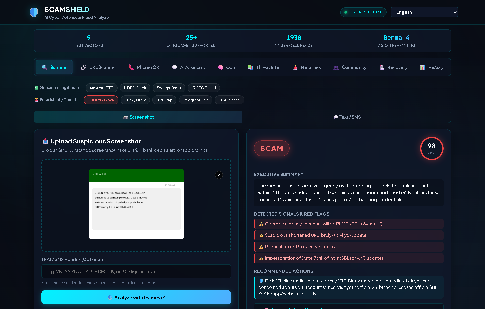 | 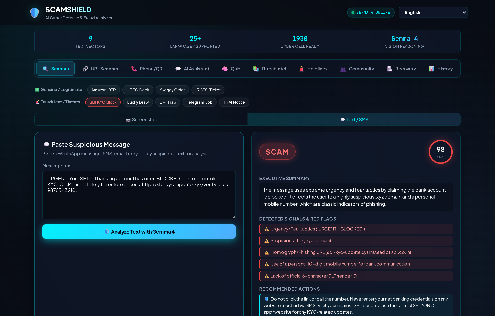 |
| **Gemma 4 Vision** extracts OCR text, visual badges, and suspicious UI markers. | **Instant semantic NLP analysis** detects panic language, urgency, and fraud patterns. |

| 🔗 Phishing & Domain Age Scanner | 📞 Phone OSINT & QR Code Defense |
|:---:|:---:|
| 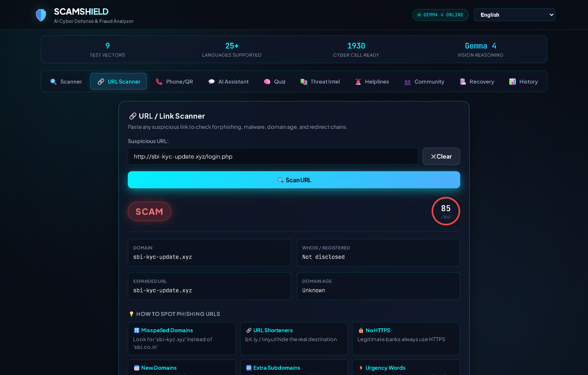 | 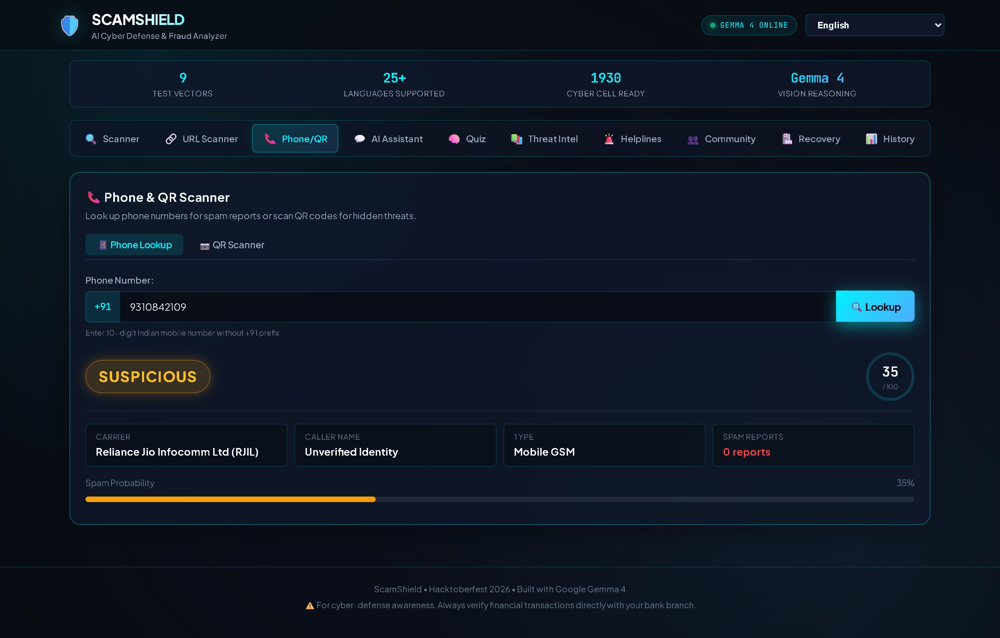 |
| Multi-layer check: Google Safe Browsing, VirusTotal, WHOIS domain age, and unshortening. | TrueCaller API, NumVerify, VoIP prefix detection & UPI VPA validation. |

| 💬 AI Safety Assistant (Markdown & KaTeX LaTeX) | 🧠 45-Question Interactive Cyber Quiz |
|:---:|:---:|
| 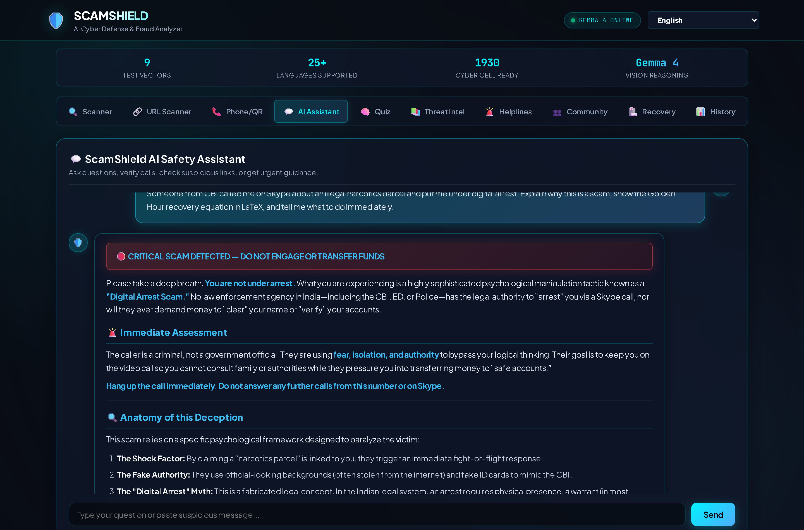 | 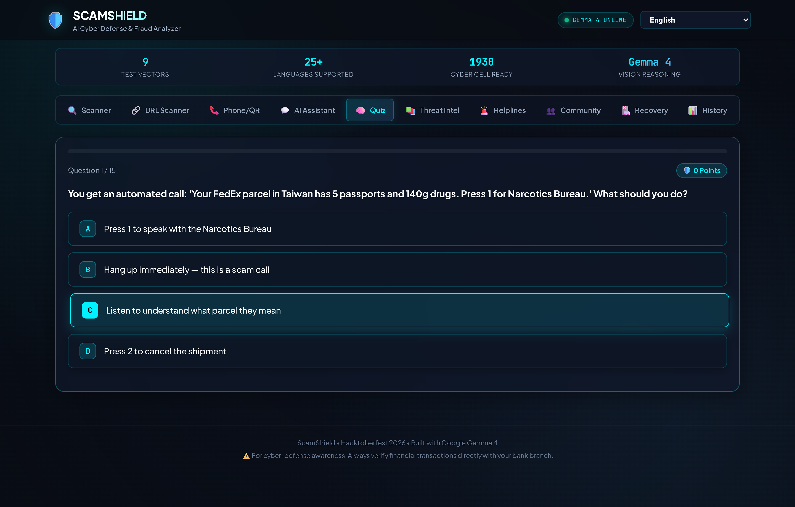 |
| Conversational AI with **KaTeX LaTeX equations**, structured alerts, and instant advice. | Dynamic 3-tier gamified awareness quiz with Shield Badges and WhatsApp sharing. |

| 🏛️ Verified Government Threat Intel | 👥 Crowdsourced Fraud Intelligence |
|:---:|:---:|
| 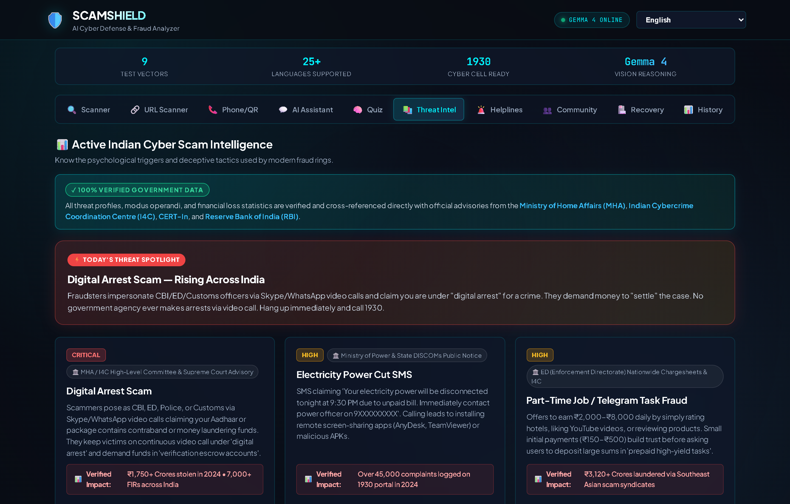 | 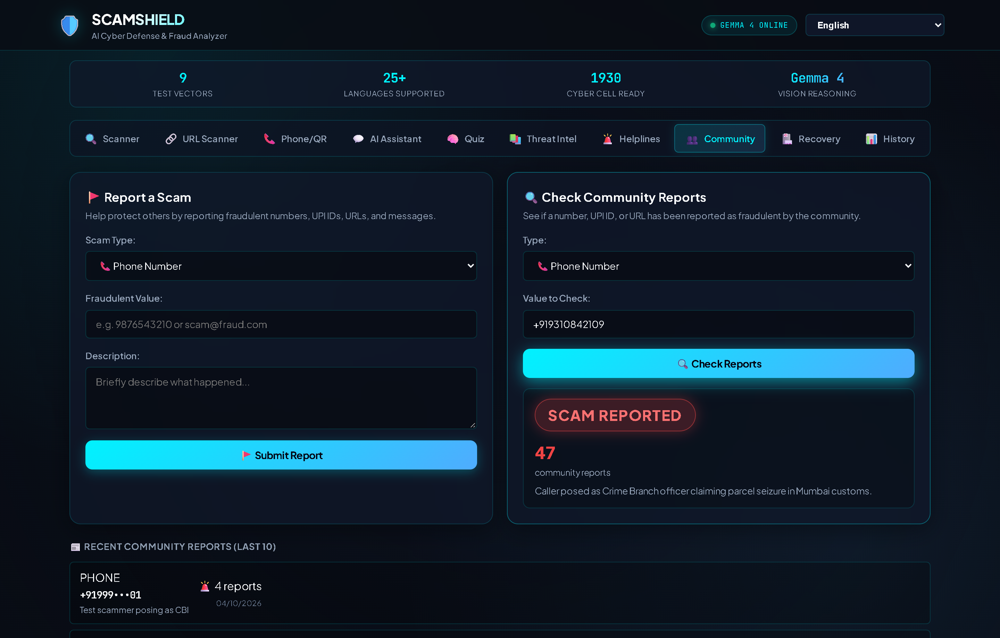 |
| **100% verified government data** from MHA, I4C, CERT-In, RBI with real loss stats. | Real-time community scam database with instant lookup and crowdsourced reporting. |

| 🏥 Golden Hour Victim Recovery Wizard | 🔐 20-Point Security Hygiene Audit |
|:---:|:---:|
| 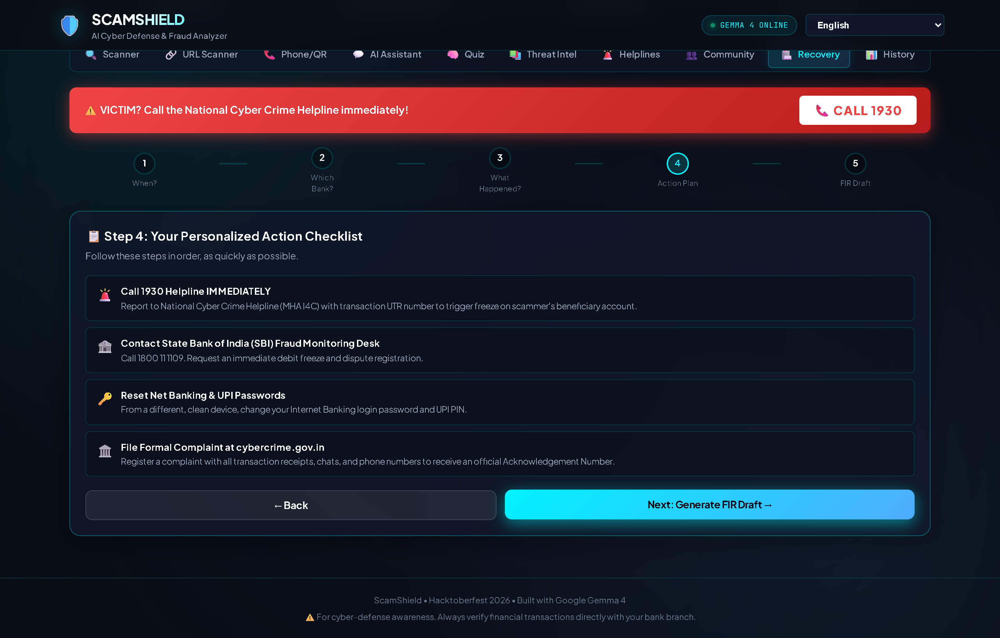 | 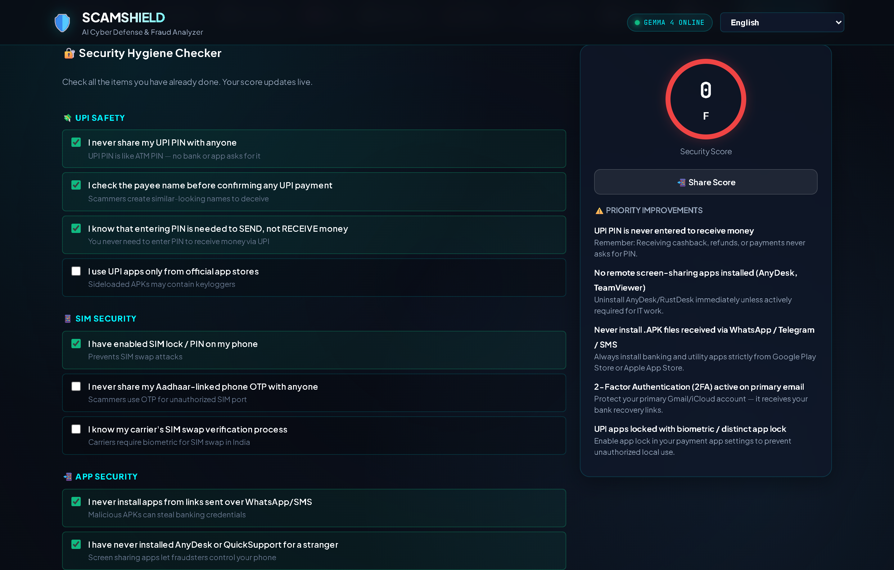 |
| Golden Hour timeline tracker, 18+ bank fraud helplines & automated FIR drafts. | Live weighted scoring across UPI, SIM, app permissions, and biometric hygiene. |

| 📊 Local Audit History & PDF Export | 📣 Family Multi-Channel Alerts |
|:---:|:---:|
| 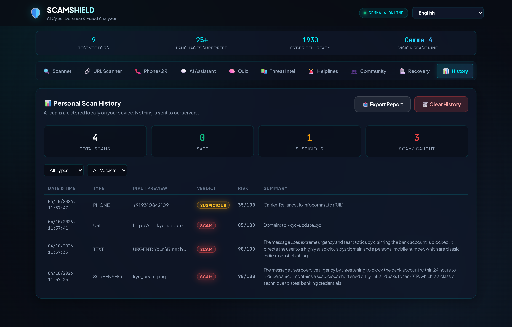 | 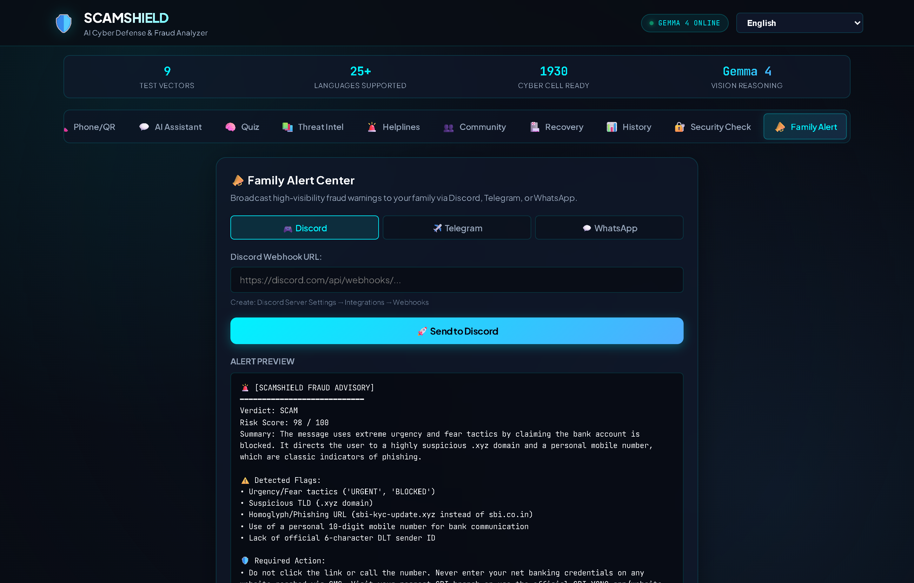 |
| Private on-device audit logging with verdict filtering and incident report exporting. | Instant high-priority alert dispatch to Discord and Telegram family safety channels. |

---

## ✨ Comprehensive Capabilities

### 1. 🛡️ Multi-Vector Threat Scanners
- **Multimodal Screenshot Scanner:** Analyzes banking alerts, WhatsApp chats, fake government summons, and app screenshots using Google Gemma 4 Vision.
- **SMS / WhatsApp Raw Text Analyzer:** Pre-filters urgency keywords and runs deep semantic evaluation with forensic breakdown of suspicious claims.
- **URL & Phishing Inspector:** Unshortens shortened links (`bit.ly`, `tinyurl`), inspects WHOIS domain registration age (flagging newly registered domains < 30 days old), queries Google Safe Browsing and VirusTotal, and identifies homoglyphs.
- **Phone OSINT & Lookup:** Cleans Indian prefixes (`+91`, `0`), queries TrueCaller RapidAPI and NumVerify, and detects high-risk virtual VoIP numbers.
- **QR Code & UPI Validator:** Decodes QR codes via `pyzbar` / Pillow, checks UPI VPAs (`@upi`, `@ybl`, etc.), and enforces the Golden Rule: *You never need to enter a UPI PIN to receive money*.

### 2. 💬 AI Safety Assistant with KaTeX LaTeX
- **Rich Markdown Formatting:** Renders clean typography, glowing alert banners, and structured breakdowns.
- **KaTeX LaTeX Equations:** Typesets mathematical recovery models ($T_{\text{Golden Hour}} \le 2\text{ hours}$), financial risk equations, and analytical metrics.
- **Multi-Turn Guidance:** Context-aware advice for active fraud encounters, extortion calls, and suspicious requests.

### 3. 🧠 Cyber Literacy & Gamified Quiz Engine
- **45 Questions Across 3 Difficulty Tiers:** Beginner, Intermediate, Expert, or Mixed.
- **Tiered Shield Badges:** Earn *Shield Rookie*, *Scam Spotter*, *Digital Defender*, *Cyber Guardian*, or *Golden Hour Hero*.
- **Detailed Explanations:** Explanations provided in both English and Hindi.
- **Social Sharing:** One-click WhatsApp score sharing with custom congratulatory messages.

### 4. 🏛️ Government-Verified Threat Intelligence
- **Official Data Sources:** Direct cross-referencing with the **Ministry of Home Affairs (MHA)**, **Indian Cybercrime Coordination Centre (I4C)**, **CERT-In**, **RBI**, and **SEBI**.
- **Real Crime Loss Statistics:** Displays real financial damages (e.g. *₹1,750+ Cr stolen in Digital Arrests in 2024*) and landmark enforcement cases.
- **Rotating Threat Spotlight:** Highlights trending scams daily with actionable reality checks.

### 5. 🚨 Victim Emergency & Golden Hour Protocol
- **Golden Hour Countdown:** Real-time urgency calculation (First 2 hours are crucial for freezing mule bank accounts).
- **18+ Indian Bank & FinTech Helplines:** Instant direct dials for SBI, HDFC, ICICI, Axis, PNB, Kotak, Paytm, PhonePe, GPay, and more.
- **Automated Police FIR / Cyber Cell Complaint Drafts:** Generates structured formal complaint letters citing relevant sections of the IT Act 2000.
- **Direct National Emergency Hotlines:** Direct dial to `1930` and links to `cybercrime.gov.in`, Sanchar Saathi, and Chakshu.

### 6. 👥 Community Fraud Intelligence & Hygiene
- **Decentralized Scam Reports:** Search and report malicious numbers, fake UPI IDs, and fraudulent URLs.
- **20-Point Cyber Hygiene Checklist:** Assesses user device readiness across UPI safety, SIM protection, app permissions, and 2FA.
- **Private On-Device Scan History:** Stores up to 100 recent scans locally with filtering and export capabilities.

---

## 🌐 25+ Supported Languages

ScamShield provides full native localization and multilingual AI reasoning across Indian regional and major global languages:

| Category | Languages Supported |
|:---|:---|
| **Indian Regional** | English, हिंदी (Hindi), ગુજરાતી (Gujarati), தமிழ் (Tamil), తెలుగు (Telugu), বাংলা (Bengali), मराठी (Marathi), ಕನ್ನಡ (Kannada), മലയാളം (Malayalam), ਪੰਜਾਬੀ (Punjabi), اردو (Urdu), ଓଡ଼ିଆ (Odia), অসমীয়া (Assamese) |
| **Global Languages** | Français, Español, Deutsch, Português, العربية (Arabic), 日本語 (Japanese), 한국어 (Korean), 中文 (Chinese), Русский (Russian), Bahasa Indonesia, Türkçe, ภาษาไทย (Thai) |

---

## 🏗️ Architecture & Project Structure

```
ScamShield/
├── api/
│   ├── index.py                    # Production Flask API & Vercel Serverless Entrypoint
│   └── requirements.txt            # Serverless dependency manifest
├── scamshield/
│   ├── analyzer.py                 # Multimodal screenshot analyzer (Gemma Vision)
│   ├── scanner_text.py             # SMS & WhatsApp raw text reasoning engine
│   ├── scanner_url.py              # Phishing, Safe Browsing, VirusTotal & WHOIS inspector
│   ├── scanner_phone.py            # Phone OSINT, TrueCaller, NumVerify & prefix validator
│   ├── scanner_qr.py               # QR code decoder & UPI payment safety evaluator
│   ├── quiz_data.py                # 45-question cyber literacy database & badges
│   ├── victim_recovery.py          # Golden Hour calculator & 18+ bank fraud directory
│   ├── hygiene.py                  # 20-point digital security hygiene scoring engine
│   ├── community.py                # Crowdsourced scam reporting store & Firestore REST
│   ├── intel.py                    # Indian cyber threat trends & reality check encyclopedia
│   ├── chat.py                     # Multi-turn cyber safety conversational assistant
│   ├── alert.py                    # Multi-channel family alerts (Discord + Telegram)
│   ├── llm.py                      # Gemma 4 LLM driver (Gemini API + Ollama fallback)
│   ├── prompts.py                  # Dual-calibrated system prompts & guidelines
│   └── i18n.py                     # Localization registry for 25+ languages
├── public/                         # Modern Cyberpunk Frontend (Single-Page App)
│   ├── index.html                  # 12-tab responsive cyber-defense portal
│   ├── style.css                   # Cyberpunk dark theme, glassmorphism & responsive CSS
│   ├── app.js                      # Client application logic, state & offline cache
│   ├── manifest.json               # Progressive Web App (PWA) manifest
│   └── samples/                    # 9 synthetic reference screenshots
├── assets/
│   └── screenshots/                # Full-resolution automated browser verification captures
├── tests/
│   ├── test_analyzer.py            # Screenshot analyzer test cases
│   ├── test_chat_intel.py          # Conversational assistant & intel tests
│   ├── test_llm.py                 # LLM driver, JSON extraction & fallback tests
│   └── test_new_features.py        # 17 end-to-end unit & integration tests
├── scripts/
│   ├── capture_screenshots.py      # Playwright screenshot generator (original)
│   └── verify_and_screenshot_all.py # Headless browser end-to-end verification suite
├── data/
│   └── community_reports.json      # Persistent local community fraud storage
├── run.py                          # Local server launcher
├── vercel.json                     # Serverless rewrite rules
└── requirements.txt                # Complete project requirements
```

---

## 🚀 Quick Start & Local Setup

### 1. Prerequisites
- Python 3.10 or higher
- A [Google AI Studio API Key](https://aistudio.google.com/apikey) (Free tier)
- *(Optional)* [Ollama](https://ollama.com/) with `gemma4:e4b` for offline fallback

### 2. Installation

```bash
git clone https://github.com/YTxFSGAMERz/hacktoberfest-ScamShield.git
cd hacktoberfest-ScamShield

# Create and activate virtual environment
python -m venv .venv
.venv\Scripts\activate   # On Windows
# source .venv/bin/activate  # On Linux/macOS

# Install dependencies
pip install -r requirements.txt
```

### 3. Environment Configuration (`.env`)

Copy the example configuration:
```bash
copy .env.example .env
```

Edit `.env` with your API keys:
```env
# Required: Google Gemini API Key
GEMINI_API_KEY=your_gemini_api_key_here
GEMINI_MODEL=gemma-4-26b-a4b-it

# Optional: Phone & URL OSINT services
TRUECALLER_API_KEY=your_rapidapi_truecaller_key
NUMVERIFY_API_KEY=your_numverify_key
VIRUSTOTAL_API_KEY=your_virustotal_key
GOOGLE_SAFE_BROWSING_KEY=your_google_safe_browsing_key

# Optional: Family Alert Webhooks
DISCORD_WEBHOOK_URL=https://discord.com/api/webhooks/...
TELEGRAM_BOT_TOKEN=
TELEGRAM_CHAT_ID=

# Offline AI Fallback
LLM_PROVIDER=auto
OLLAMA_BASE_URL=http://localhost:11434
OLLAMA_MODEL=gemma4:e4b
```

### 4. Run Application

```bash
python run.py
```
Open **[http://127.0.0.1:5000](http://127.0.0.1:5000)** in your web browser.

---

## 🧪 Automated Test Suite

ScamShield includes **54 automated unit and integration tests** verifying all scanning engines, fallback states, question banks, and API routes:

```bash
pytest tests/ -v
```

```
============================= test session starts =============================
collected 54 items

tests/test_analyzer.py ...........                                       [ 20%]
tests/test_chat_intel.py .......                                         [ 33%]
tests/test_llm.py ....................                                    [ 68%]
tests/test_new_features.py .................                             [100%]

============================= 54 passed in 37.62s =============================
```

---

## 🔒 Security, Privacy & Responsible AI

- **Zero Permanent Storage of Evidence:** Uploaded screenshots, text clips, and numbers are analyzed strictly in memory during the request lifecycle.
- **Fail-Safe Fallbacks:** All external OSINT lookups (TrueCaller, VirusTotal, NumVerify, WHOIS) fail gracefully without breaking the user flow if credentials are not configured or rate limits are hit.
- **Rate Limiting:** Built-in IP rate limiting powered by `Flask-Limiter` protects endpoints from scraping or abuse.
- **Indian Legal Context:** All guidance adheres to the IT Act 2000, Bharatiya Nyaya Sanhita (BNS), and RBI circulars regarding zero customer liability in unauthorized electronic banking transactions.

---

## 🤝 Contributing

Contributions are welcomed as part of **Hacktoberfest 2026**!

1. Fork the repository
2. Create a feature branch (`git checkout -b feature/cyber-innovation`)
3. Commit your changes (`git commit -m 'feat: add advanced deepfake audio detector'`)
4. Push to your branch (`git push origin feature/cyber-innovation`)
5. Open a Pull Request

---

## 📄 License

Distributed under the **MIT License**. See [`LICENSE`](LICENSE) for details.
