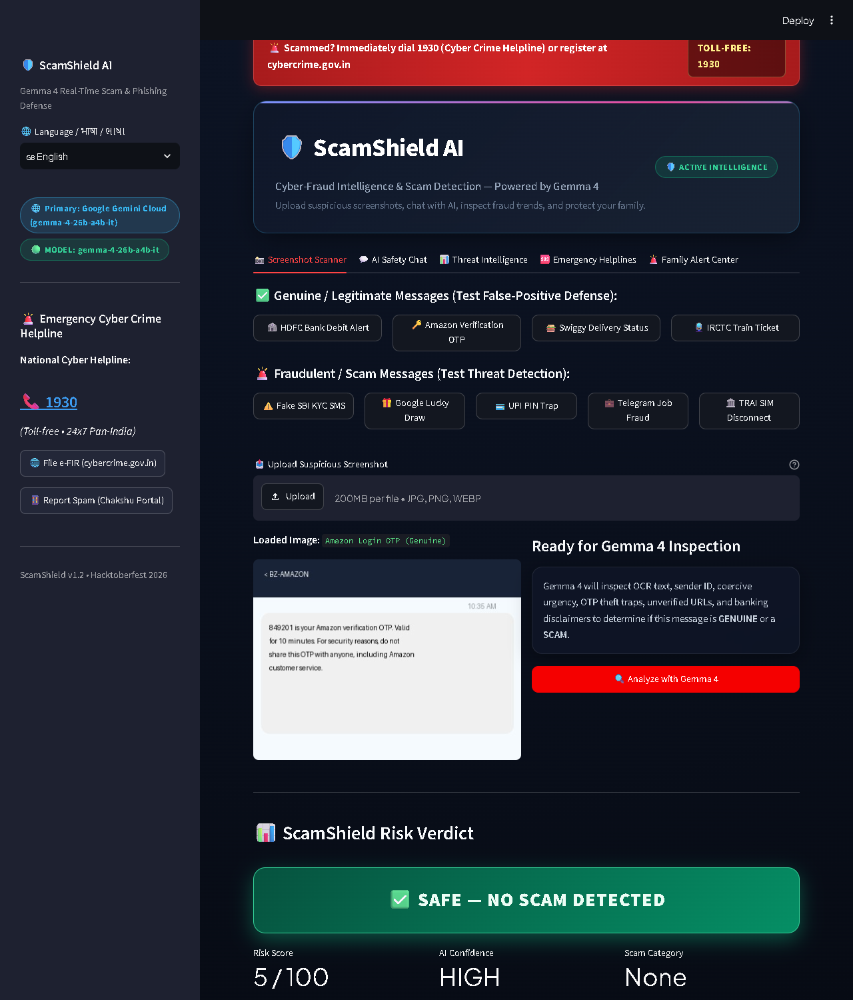

# 🛡️ ScamShield

**ScamShield** is an AI-powered cyber-threat and scam detection suite built with Google Gemma 4. Upload a screenshot of any suspicious message, banking SMS, UPI QR, or website and receive an instant, multi-dimensional risk analysis — in **English**, **Hindi (हिंदी)**, or **Gujarati (ગુજરાતી)**.

ScamShield is specifically calibrated to protect Indian citizens from rampant fraud vectors (Digital Arrest, Electricity Bill threats, UPI refund traps, Fake APK loans) while preventing false-positive panic on legitimate transaction alerts and authentic OTPs.

Built for **Hacktoberfest 2026**.

---



---

## ✨ Key Features

- 🤖 **Gemma 4 AI Reasoning** — Powered by `gemma-4-26b-a4b-it` via Gemini API (primary) with native thought token extraction, and local Ollama `gemma4:e4b` (offline fallback).
- ⚖️ **False-Positive Resistance** — Differentiates genuine bank debits, official TRAI sender headers (e.g. `AD-HDFCBK`, `VK-AMZNOT`), and routine OTPs from actual phishing traps.
- 💬 **Interactive AI Safety Assistant** — Multi-turn conversational dashboard allowing users to ask questions like *"Someone from CBI called me on Skype, what should I do?"* with full screenshot scan context.
- 📚 **Threat Intel & Scam Encyclopedia** — Interactive breakdown of top Indian cyber scam modus operandi (Digital Arrest, Electricity SMS, UPI Phishing, Telegram Part-Time Jobs, Fake Loan APKs).
- 🚨 **Golden Hour Recovery Protocol** — Direct access to critical emergency resources: National Cyber Crime Helpline `1930`, `cybercrime.gov.in`, Chakshu fraud reporting, and Sanchar Saathi IMEI blocking.
- 📣 **Family Alert Center** — One-click Discord webhook alert dispatching colored risk embeds (Green / Orange / Red) with automatic clipboard fallback.
- 🌍 **Trilingual Support** — Complete native localization across English, Hindi, and Gujarati for both UI elements and AI reasoning outputs.
- ⚡ **1-Click Test Scenarios** — Built-in quick chip selectors featuring 4 genuine and 5 scam screenshot test cases.

---

## 🚀 Quick Start

### Prerequisites
- Python 3.10+
- A [Gemini API key](https://aistudio.google.com/apikey) (Free tier works)
- *(Optional)* [Ollama](https://ollama.com) with `gemma4:e4b` for offline fallback

### Installation

```bash
git clone https://github.com/YTxFSGAMERz/hacktoberfest-ScamShield
cd hacktoberfest-ScamShield

# Create virtual environment
python -m venv .venv
.venv\Scripts\activate   # Windows
# source .venv/bin/activate  # Linux/Mac

# Install dependencies
pip install -r requirements.txt

# Configure secrets
copy .env.example .env
# Edit .env with your keys
```

### Configuration (`.env`)

```env
# Required: Gemini API key from https://aistudio.google.com/apikey
GEMINI_API_KEY=your_gemini_api_key_here

# Optional: Discord webhook for family alerts
DISCORD_WEBHOOK_URL=https://discord.com/api/webhooks/...

# AI provider: auto | gemini | ollama
LLM_PROVIDER=auto

# Gemini model (official Gemma 4 model on Gemini API)
GEMINI_MODEL=gemma-4-26b-a4b-it

# Ollama model (offline fallback)
OLLAMA_MODEL=gemma4:e4b
OLLAMA_BASE_URL=http://localhost:11434
```

### Run Application

```bash
streamlit run app.py
```

Open [http://localhost:8501](http://localhost:8501) in your browser.

---

## 🏗️ Architecture

```
ScamShield/
├── app.py                     # Streamlit Cyber-Shield UI (5 tabs, glassmorphic dark theme)
├── scamshield/
│   ├── analyzer.py            # Multimodal verification & risk scoring pipeline
│   ├── llm.py                 # Gemma 4 LLM driver (Gemini REST + Ollama fallback)
│   ├── prompts.py             # Dual-calibrated system & user prompts
│   ├── chat.py                # Conversational AI safety assistant
│   ├── intel.py               # Indian threat intelligence & emergency recovery
│   ├── alert.py               # Discord embed webhook & clipboard fallback
│   └── i18n.py                # Trilingual dictionary (EN, HI, GU)
├── tests/
│   ├── generate_samples.py    # Synthetic realistic screenshot generator
│   ├── test_analyzer.py       # Core analysis unit tests
│   ├── test_llm.py            # Gemma 4 driver & fallback tests
│   ├── test_chat_intel.py     # Chat assistant & threat intel tests
│   └── samples/               # 9 synthetic screenshots (4 genuine + 5 scam)
├── assets/                    # UI previews and badges
├── requirements.txt
├── pytest.ini
├── LICENSE                    # MIT License
└── README.md
```

---

## 🧪 Automated Testing

ScamShield includes a comprehensive automated test suite with 34 tests covering image processing, prompt formatting, payload normalization, error handling, conversational memory, and threat encyclopedia lookups:

```bash
pytest tests/ -v
```

```
============================== 34 passed in 2.14s ==============================
```

---

## 🌐 Supported Languages

| Language | UI Interface | Gemma 4 AI Analysis | Emergency Protocol |
|:---|:---:|:---:|:---:|
| **English** | ✅ | ✅ | ✅ |
| **हिंदी (Hindi)** | ✅ | ✅ | ✅ |
| **ગુજરાતી (Gujarati)** | ✅ | ✅ | ✅ |

---

## 🔒 Privacy & Safety

- **In-Memory Only:** Uploaded images and screenshots are analyzed strictly in-memory and never written to disk or sent to 3rd party trackers.
- **Zero Telemetry:** No user analytics or tracking scripts are included.
- **Credential Safety:** All keys remain strictly on the host in `.env` (gitignored).

---

## 🤝 Contributing

This project is open-source and part of **Hacktoberfest 2026**! Contributions, bug reports, and PRs are welcome.

1. Fork the repo
2. Create a feature branch (`git checkout -b feature/amazing-feature`)
3. Commit your changes (`git commit -m 'feat: add amazing feature'`)
4. Push to branch (`git push origin feature/amazing-feature`)
5. Open a Pull Request

---

## 📄 License

MIT License — Copyright (c) 2026 YTxFSGAMERz. See [LICENSE](LICENSE) for full details.
